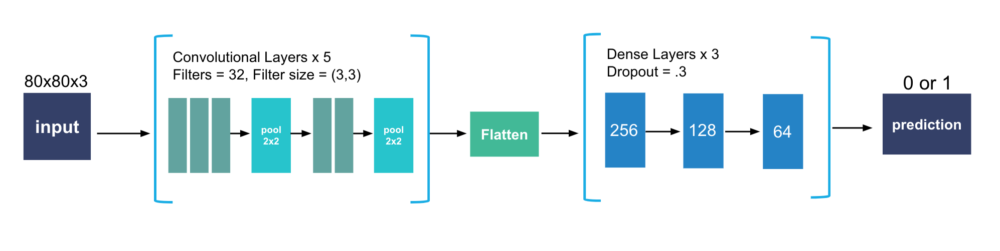

## Hệ Thống Nhận Diện Ngủ Gật Cho Người Lái Xe
Hệ thống sử dụng mô hình Deep Learning (CNN) để phân loại trạng thái mắt của người lái xe, kết hợp với MediaPipe để nhận diện khuôn mặt và xác định vị trí mắt. Khi phát hiện tài xế nhắm mắt quá lâu (ngủ gật), hệ thống sẽ phát cảnh báo.
## Cấu trúc mô hình CNN
3 lớp Conv2D (32 filter) + MaxPooling.
2 lớp Conv2D (32 filter) + MaxPooling.
3 lớp Fully Connected với Dropout (256, 128, 64 units).
Lớp đầu ra sigmoid với 1 neuron (phân loại nhị phân).

## Cài đặt
opencv-python.
numpy.
tensorflow.
mediapipe.
playsound.

## Cấu trúc chương trình (main.py)

1. **Khởi tạo và tải mô hình**
   - Tải mô hình nhận diện trạng thái mắt (mở/nhắm) đã huấn luyện.
   - Khởi tạo các module MediaPipe để nhận diện khuôn mặt và landmark.

2. **Mở webcam và đọc từng frame**
   - Đọc ảnh từ webcam liên tục để xử lý.

3. **Nhận diện khuôn mặt và landmark**
   - Sử dụng MediaPipe để phát hiện khuôn mặt và lấy các điểm landmark trên khuôn mặt (468 điểm).

4. **Cắt vùng mắt trái và phải**
   - Dựa vào các chỉ số landmark quanh mắt, cắt vùng mắt trái và phải từ ảnh gốc.

5. **Dự đoán trạng thái mắt**
   - Đưa ảnh vùng mắt vào mô hình học sâu để dự đoán xác suất mắt mở/nhắm.
   - Làm mượt kết quả dự đoán bằng buffer (left_buf, right_buf) để giảm nhiễu.

6. **Kiểm tra trạng thái mắt và phát hiện ngủ gật**
   - Nếu cả hai mắt nhắm liên tục vượt quá ngưỡng thời gian cho phép (`SLEEP_THRESHOLD_TIME`), tăng biến đếm số lần ngủ gật và phát cảnh báo âm thanh.

7. **Hiển thị thông tin lên màn hình**
   - Hiển thị trạng thái mắt, số lần ngủ gật, thời gian xử lý mỗi frame và cảnh báo nếu có.

8. **Kết thúc chương trình**
   - Nhấn phím ESC để thoát, giải phóng tài nguyên và đóng các module.

---

# Hướng dẫn
Đảm bảo đã cài đặt các thư viện cần thiết.
Huấn luyện mô hình (nếu chưa có): python train_model.py.
Chạy chương trình chính: python main.py.
Nhấn phím ESC để thoát.