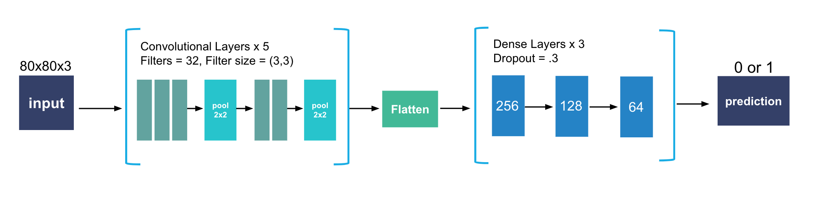

# Hệ Thống Nhận Diện Ngủ Gật Cho Người Lái Xe

Hệ thống sử dụng Deep Learning (CNN) và MediaPipe để phát hiện tình trạng buồn ngủ của tài xế, phát cảnh báo âm thanh khi phát hiện mắt nhắm quá lâu.

## Tính Năng

- **Nhận diện khuôn mặt**: Sử dụng MediaPipe FaceMesh để detect khuôn mặt với 468 landmarks
- **Phân tích trạng thái mắt**: Model CNN phân loại trạng thái mắt mở/nhắm
- **Phát hiện ngủ gật**: Theo dõi thời gian nhắm mắt liên tục
- **Cảnh báo âm thanh**: Phát âm thanh alarm khi phát hiện buồn ngủ
- **Điều khiển real-time**: Các phím tắt để điều chỉnh hiển thị

## Kiến Trúc Mô Hình CNN

Mô hình sử dụng kiến trúc CNN đơn giản với:
- 3 lớp Convolutional (32 filters) + MaxPooling
- 3 lớp Fully Connected với Dropout (256, 128, 64 units)  
- Lớp output sigmoid (phân loại nhị phân mắt mở/nhắm)



## Yêu Cầu Hệ Thống

- Python 3.8+
- Camera/Webcam
- Loa hoặc tai nghe

## Cài Đặt và Chạy

### 1. Cài đặt dependencies
```bash
pip install -r requirements.txt
```

### 2. Chạy chương trình chính
```bash
python main.py
```

### 3. Test model riêng lẻ (tùy chọn)
```bash
# Test model với ảnh tĩnh
python test_model.py
```

## Điều Khiển Trong Khi Chạy

| Phím | Chức năng |
|------|-----------|
| `q` | Thoát chương trình |
| `t` | Bật/tắt tesselation landmarks |
| `c` | Bật/tắt contour landmarks |
| `i` | Bật/tắt iris landmarks |
| `p` | Bật/tắt tiền xử lý frame |
| `r` | Reset (bật tất cả landmarks) |
| `s` | Dừng cảnh báo âm thanh |

## Cấu Trúc Dự Án

```
FirstTry/
├── DriverDetection/           # Module chính
│   ├── main.py               # Chương trình chính
│   ├── driver_monitor.py     # Class quản lý hệ thống
│   ├── frame_processor.py    # Xử lý frame và landmarks
│   ├── eye_processor.py      # Phân tích trạng thái mắt
│   └── model.py              # Load AI model
├── models/                   # Trained models
│   ├── model.keras           # Model chính
│   └── best_model_first_try.keras
├── data/                     # Dataset
│   ├── train/               # Dữ liệu training
│   └── test/                # Dữ liệu testing
├── requirements.txt          # Dependencies
├── test_model.py            # Script test model
├── alarm.wav                # File âm thanh cảnh báo
└── README.md                # Documentation
```

## Cách Hoạt Động

1. **Khởi tạo camera và model**
   - Load model CNN đã train từ `models/model.keras`
   - Khởi tạo MediaPipe FaceMesh để detect khuôn mặt

2. **Xử lý frame real-time**
   - Capture frame từ webcam
   - Detect khuôn mặt và 468 facial landmarks
   - Trích xuất vùng mắt trái và phải

3. **Phân tích trạng thái mắt**
   - Resize ảnh mắt về 80x80 pixels
   - Đưa vào model CNN để predict mở/nhắm
   - Áp dụng smoothing để giảm noise

4. **Phát hiện ngủ gật**
   - Theo dõi thời gian nhắm mắt liên tục
   - Khi vượt quá ngưỡng thời gian (mặc định 1.0s) → phát cảnh báo

5. **Hiển thị kết quả**
   - Vẽ landmarks trên khuôn mặt
   - Hiển thị trạng thái mắt và thời gian
   - Phát âm thanh cảnh báo khi cần

## Xử Lý Lỗi Thường Gặp

**Camera không hoạt động:**
```bash
# Kiểm tra camera
python -c "import cv2; print(cv2.VideoCapture(0).isOpened())"
```

**Model không load được:**
- Đảm bảo file `models/model.keras` tồn tại
- Kiểm tra phiên bản TensorFlow/Keras

**Không có âm thanh cảnh báo:**
- Kiểm tra file `alarm.wav` tồn tại
- Đảm bảo có loa/tai nghe kết nối

**Performance chậm:**
- Tắt preprocessing bằng phím `p`
- Giảm resolution camera nếu cần

## Dependencies

- `opencv-python` - Computer vision và xử lý ảnh
- `tensorflow` - Deep learning framework  
- `keras` - High-level neural networks API
- `numpy` - Tính toán khoa học
- `Pillow` - Xử lý ảnh
- `mediapipe` - Face detection và landmarks
- `playsound` - Phát âm thanh cảnh báo

---

**Lưu ý**: Hệ thống này chỉ là công cụ hỗ trợ. Tài xế vẫn cần chịu trách nhiệm đảm bảo an toàn khi lái xe.